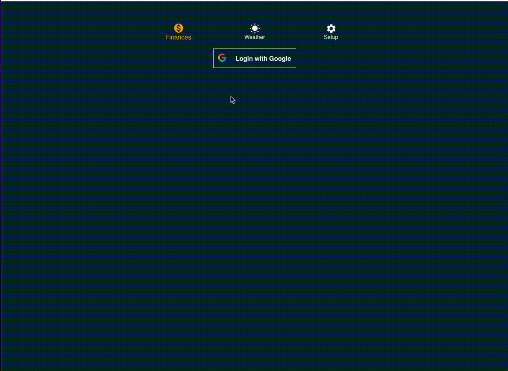

# About

This is a simple react web application that I developed and maintain on the side.
I mostly use this app to track finances using the google sheets.

This application is built using React, Redux for state management and D3 js for the data visualisation

### CI/CD

I am using the bitbucket pipeline to do a continuous delivery to my [Dockerhub](https://hub.docker.com/repository/docker/deepaky193/personal_finance_app)

### Backend

The data used in the application is currently being fetched from google sheets (on google Drive). Future plan is to move that data or start recording the data on a Nodejs Server located at `/Server` directory.

### Application Demo

